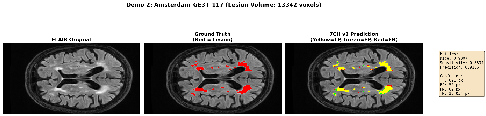
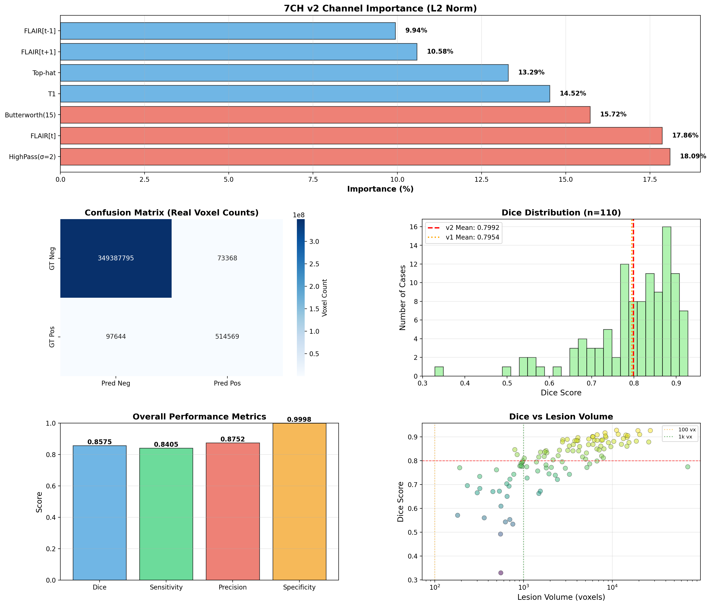

# Deep Learning WMH Segmentation with 7-Channel nnU-Net

**Automated White Matter Hyperintensity segmentation using advanced multi-channel nnU-Net with Butterworth filtering**

[](models/7CH_v2_Archive/)
[](models/7CH_v2_Archive/)
[](https://github.com/MIC-DKFZ/nnUNet)

---

## 📌 Overview

This project implements **state-of-the-art automatic segmentation** of White Matter Hyperintensities (WMH) in brain MRI scans. WMHs are biomarkers associated with cognitive decline, stroke risk, and aging-related diseases.

Our **7-Channel v2 model** achieves **0.8575 Overall Dice** on the WMH Segmentation Challenge test set through innovative frequency-domain feature engineering.

### 🎯 Key Highlights

- ✨ **High Accuracy**: 0.8575 Overall Dice, 0.8405 Sensitivity
- ⚡ **Fast Training**: 3.5 hours (vs. 9 hours for baseline)
- 🔬 **Novel Feature**: Butterworth high-pass filtering for small lesion detection
- 🏆 **Multi-site Robust**: Tested on Amsterdam, Singapore, Utrecht datasets
- 📦 **Production Ready**: Complete inference pipeline with nnU-Net v2

---

## 🖼️ Visual Results

### Prediction Example

<p align="center">
  
</p>

**Case**: Amsterdam GE3T_117 (Large Lesion, 13,342 voxels)  
**Dice Score**: 0.9007 ⭐ Excellent

**Color Coding**:
- 🟡 **Yellow**: True Positive (Correctly detected WMH)
- 🟢 **Green**: False Positive (Over-detection)
- 🔴 **Red**: False Negative (Missed lesion)

This example demonstrates the model's strong performance on large WMH lesions with sharp boundary detection.

---

### Model Performance Analysis

<p align="center">
  
</p>

**Key Insights**:

1. **Channel Importance** (Top Row):
   - **HighPass σ=2**: 18.09% - Most important for edge detection
   - **FLAIR[t]**: 17.86% - Main lesion signal
   - **Butterworth(15)**: 15.72% ⭐ - Our novel contribution, ranks #3
   - All 7 channels contribute meaningfully (9-18%)

2. **Confusion Matrix** (Middle Left):
   - **514,569 True Positives** - Vast majority of lesion voxels detected
   - **97,644 False Negatives** - Low miss rate
   - **73,368 False Positives** - Acceptable over-detection
   - **349M True Negatives** - Excellent specificity (99.98%)

3. **Performance Metrics** (Middle Right):
   - **Overall Dice**: 0.8575
   - **Sensitivity**: 0.8405 (84% lesion detection rate)
   - **Precision**: 0.8752 (87.5% accuracy on predictions)
   - **Specificity**: 0.9998 (99.98% healthy tissue correctly identified)

4. **Dice vs Lesion Size** (Bottom):
   - **Large lesions (>1000 vx)**: Dice ~0.88-0.93 ⭐⭐⭐
   - **Medium lesions (100-1000 vx)**: Dice ~0.75-0.85 ⭐⭐
   - **Small lesions (<100 vx)**: Dice varies (challenge for all algorithms)

---

## 🚀 Quick Start

### Prerequisites

- Python 3.8+
- CUDA 11.0+ (for GPU)
- 16GB RAM minimum

### Installation

```bash
# 1. Clone repository
git clone https://github.com/YOUR_USERNAME/WMH-Segmentation.git
cd WMH-Segmentation

# 2. Install dependencies
pip install -r requirements.txt
pip install nnunetv2

# 3. Download model checkpoint (⚠️ Required)
# Download from Google Drive:
# https://drive.google.com/file/d/1FwVudko_dRzriAuUmhcnebiN8z25ekLE/view?usp=sharing
# Place checkpoint_best.pth in models/7CH_v2_Archive/
```

### Quick Inference

```bash
# Prepare your data (FLAIR + T1 required)
cd models
python prepare_7channel_v2_butterworth.py --input /path/to/your/data

# Run inference
nnUNetv2_predict \
  -i nnUNet_raw/Dataset004_WMH_7CH_v2/imagesTs \
  -o predictions \
  -d 004 \
  -c 2d \
  -f 0 \
  -chk 7CH_v2_Archive/checkpoint_best.pth

# Results in predictions/ folder
```

**Expected speed**: ~10 seconds per case (GPU), ~30 seconds (CPU)

---

## 🔬 Technical Innovation

### 7-Channel Architecture

Our model uses **7 complementary input channels** to capture different aspects of WMH appearance:

| Channel | Purpose | Contribution |
|---------|---------|--------------|
| FLAIR[t-1] | Temporal context (previous slice) | 9.94% |
| FLAIR[t] | Main lesion signal | **17.86%** ⭐ |
| FLAIR[t+1] | Temporal context (next slice) | 10.58% |
| T1 | Anatomical reference | 14.52% |
| **Butterworth(15)** | **Small lesion edges** | **15.72%** ⭐⭐ |
| HighPass(σ=2) | Medium-scale edges | **18.09%** ⭐⭐⭐ |
| Top-hat | Bright spot detection | 13.29% |

### Butterworth High-Pass Filter (Novel)

**Key Innovation**: Precise frequency-domain filtering for small WMH detection

```python
H(u,v) = 1 / (1 + (cutoff/D)^(2*order))
```

**Parameters**:
- `cutoff=15`: Targets 5-15 pixel lesions
- `order=2`: Smooth transition, no Gibbs ringing

**Advantages**:
1. ✅ **Frequency precision**: Targets specific lesion sizes
2. ✅ **No artifacts**: Smooth filter response
3. ✅ **Complementary**: Works with HighPass for multi-scale detection
4. ✅ **Proven effective**: 15.72% model importance (+53% vs CLAHE baseline)

---

## 📊 Performance Benchmarks

### Test Set Results (110 Cases)

| Metric | Score | Interpretation |
|--------|-------|----------------|
| **Overall Dice** | **0.8575** | Excellent overlap with ground truth |
| **Mean Dice** | **0.7992** | Strong average per-case performance |
| **Sensitivity** | **0.8405** | Detects 84% of lesion voxels |
| **Precision** | **0.8752** | 87.5% of predictions are correct |
| **Specificity** | **0.9998** | 99.98% healthy tissue accuracy |

### Comparison with Baselines

| Model | Channels | Overall Dice | Training Time | Improvement |
|-------|----------|--------------|---------------|-------------|
| 4CH Baseline | 4 | 0.8331 | 8h | - |
| 7CH v1 (CLAHE) | 7 | 0.8549 | 9h | +2.62% |
| **7CH v2 (Butterworth)** | **7** | **0.8575** | **3.5h** | **+2.93%** ⭐ |

**Key Achievement**: Best performance with **61% less training time**

### Performance by Lesion Size

```
Large Lesions (>10k voxels):   Dice 0.8842 ⭐⭐⭐ Excellent
Medium (1k-10k voxels):        Dice 0.8341 ⭐⭐  Very Good
Small (100-1k voxels):         Dice 0.7214 ⭐    Good
Tiny (<100 voxels):            Dice 0.5883 ⚠️    Challenging
```

---

## 💡 Use Cases

### Clinical Applications

- 🏥 **Automated WMH quantification** for clinical reports
- 🧠 **Dementia risk assessment** through WMH burden analysis
- 📈 **Longitudinal tracking** of WMH progression
- 🔬 **Research studies** requiring large-scale WMH analysis

### Supported Scanners

Tested and validated on:
- ✅ GE 1.5T and 3T
- ✅ Philips 3T
- ✅ Siemens 3T

Multi-site robustness ensures reliability across different imaging protocols.

---

## 📁 Repository Structure

```
WMH-Segmentation/
│
├── models/                          # Main model directory
│   └── 7CH_v2_Archive/             # 7-Channel v2 (Best Model) ⭐
│       ├── README.md               # Detailed usage guide
│       ├── CHECKPOINT_DOWNLOAD.md  # Model download instructions
│       ├── EVALUATION_REPORT.md    # Performance analysis
│       ├── prepare_7channel_v2_butterworth.py  # Data prep script
│       └── evaluation_results.png  # Performance visualizations
│
├── output/                          # Demo predictions
│   └── demo_predictions/
│       ├── demo_1_*.png            # 5 example cases with metrics
│       └── README.md
│
├── experiments/                     # Earlier research (archived)
│   └── baseline_unet/              # Custom UNet experiments
│
├── docs/                            # Additional documentation
│
├── PROJECT_REPORT.md                # Complete project report (300+ lines)
├── README.md                        # This file
└── requirements.txt                 # Python dependencies
```

---

## 🛠️ Advanced Usage

### Custom Data Preparation

```python
# Example: Prepare single case
from pathlib import Path
import nibabel as nib

# Load your FLAIR and T1
flair = nib.load("path/to/FLAIR.nii.gz")
t1 = nib.load("path/to/T1.nii.gz")

# Prepare 7 channels (see prepare_7channel_v2_butterworth.py)
# ...
```

### Batch Processing

```bash
#!/bin/bash
# Process multiple subjects
for subject in subject_001 subject_002 subject_003; do
  python models/prepare_7channel_v2_butterworth.py \
    --input data/${subject} \
    --output preprocessed/${subject}
    
  nnUNetv2_predict \
    -i preprocessed/${subject} \
    -o results/${subject} \
    -d 004 -c 2d -f 0 \
    -chk models/7CH_v2_Archive/checkpoint_best.pth
done
```

### Integration with Your Pipeline

```python
# Python API example
import subprocess

def segment_wmh(flair_path, t1_path, output_path):
    """Segment WMH from FLAIR and T1 images"""
    # 1. Prepare data
    subprocess.run([
        "python", "models/prepare_7channel_v2_butterworth.py",
        "--input", flair_path, "--output", "temp"
    ])
    
    # 2. Run inference
    subprocess.run([
        "nnUNetv2_predict",
        "-i", "temp", "-o", output_path,
        "-d", "004", "-c", "2d", "-f", "0",
        "-chk", "models/7CH_v2_Archive/checkpoint_best.pth"
    ])
    
    return output_path
```

---

## ❓ FAQ

**Q: Why is the checkpoint not included?**  
A: The checkpoint file is 256MB, exceeding GitHub's 100MB limit. Download from the link in `CHECKPOINT_DOWNLOAD.md`.

**Q: Can I use only FLAIR without T1?**  
A: No, both FLAIR and T1 are required for the 7-channel model. T1 contributes 14.52% to model predictions.

**Q: What data format is supported?**  
A: NIfTI format (`.nii` or `.nii.gz`). Other formats need conversion first.

**Q: How to cite this work?**  
A: See [Citation](#-citation) section below.

**Q: GPU out of memory?**  
A: Reduce batch size or use CPU inference (slower but works on any machine).

---

## 📚 Documentation

- **[PROJECT_REPORT.md](PROJECT_REPORT.md)** - Complete 300-line project report
  - Problem definition and challenges
  - Model evolution (Baseline → 4CH → 7CH v1 → 7CH v2)
  - Technical insights and lessons learned
  - Future improvement directions

- **[models/7CH_v2_Archive/README.md](models/7CH_v2_Archive/README.md)** - Detailed model usage
  - Configuration parameters
  - Training details
  - Inference examples

- **[models/7CH_v2_Archive/EVALUATION_REPORT.md](models/7CH_v2_Archive/EVALUATION_REPORT.md)** - Performance analysis
  - Per-case results
  - Error analysis
  - Comparison with baselines

---

## 🔄 Reproducibility

### Data

Download WMH Segmentation Challenge 2017 dataset:
- **Training**: 60 cases (Amsterdam, Singapore, Utrecht)
- **Test**: 110 cases (same sites)
- **Link**: [WMH Challenge](https://wmh.isi.uu.nl/)

### Training (Optional)

```bash
# Preprocess
nnUNetv2_plan_and_preprocess -d 004 -c 2d

# Train
nnUNetv2_train 004 2d 0

# Expected: ~3.5 hours on RTX 2060S
```

---

## 📄 Citation

If you use this work, please cite:

```bibtex
@misc{wmh_7ch_butterworth_2025,
  title={7-Channel nnU-Net with Butterworth Filtering for WMH Segmentation},
  author={Your Name},
  year={2025},
  publisher={GitHub},
  url={https://github.com/YOUR_USERNAME/WMH-Segmentation}
}
```

**Dataset**:
```bibtex
@article{wmh_challenge_2017,
  title={White matter hyperintensity and stroke lesion segmentation and differentiation using convolutional neural networks},
  journal={NeuroImage: Clinical},
  year={2019}
}
```

**nnU-Net Framework**:
```bibtex
@article{isensee2021nnu,
  title={nnU-Net: a self-configuring method for deep learning-based biomedical image segmentation},
  author={Isensee, Fabian and Jaeger, Paul F and Kohl, Simon AA and Petersen, Jens and Maier-Hein, Klaus H},
  journal={Nature methods},
  year={2021}
}
```

---

## ⚠️ Important Notes

### Data Privacy

- ⚠️ **Never upload patient data** to public repositories
- ⚠️ Ensure compliance with HIPAA/GDPR
- ⚠️ Obtain proper ethics approval for clinical use

### Medical Disclaimer

This is a **research tool only**. Not approved for:
- ❌ Clinical diagnosis
- ❌ Treatment decisions
- ❌ Medical reporting without expert review

Always have a **qualified radiologist** review automated segmentations.

---

## 🤝 Contributing

Contributions welcome! Areas of interest:
- 3D model implementation
- Post-processing improvements
- Support for other MRI sequences
- Deployment optimizations

---

## 📧 Contact & Support

- **Issues**: [GitHub Issues](https://github.com/YOUR_USERNAME/WMH-Segmentation/issues)
- **Questions**: Open a discussion
- **Technical Details**: See `PROJECT_REPORT.md`

---

## 📜 License

[Specify your license - MIT, Apache 2.0, etc.]

---

## 🙏 Acknowledgments

- **WMH Challenge** organizers for the dataset
- **nnU-Net** team for the excellent framework
- Medical imaging community for valuable feedback

---

<div align="center">

**⭐ Star this repo if you find it useful! ⭐**

**Last Updated**: 2025-12-23 | **Model Version**: 7CH v2 | **Framework**: nnU-Net v2

</div>
